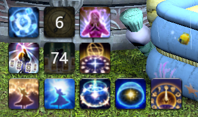
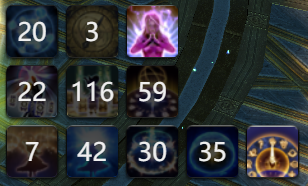
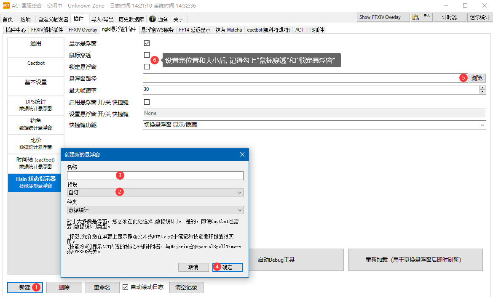

# Final Fantasy XIV Status Indicator

## Hello from Hsin

### 说明

自己平常使用的状态指示器(偶尔会多修改修改...), 指示器会在战斗或者进行指定操作的时候自动显示, 其它时候默认隐藏, 在战斗结束后, 过一段时间也会自动隐藏

有占星的技能倒计时指示器和钓鱼以小钓大超大字体提示~ 0 .0... 主要是我经常会忘记我正在以小钓大.....

倒计时功能其实与游戏中的会差几百毫秒左右, 因为是使用 ACT 提供的日志来解析的, 日志只能做到尽量实时, 但是实际使用上并不会差得太多, 还是可以很直观的显示倒计时的情况的

功能只是用于满足很普通的状态显示~ 并没有把细节做好..

### 目前支持的小功能

- 占星状态指示器
- 钓鱼以小钓大提示

### 样子

### ACT 插件添加悬浮窗

在 ACT 国服整合中新建 ngld 悬浮窗, 悬浮窗路径选择到 index.html 即可(国际服 ACT 没测试过... 但是理论上是通用的, 数据的格式应该是不会变的才是)
拖动窗口到合适位置, 并修改大小, 完成后锁定窗口就可以了~

